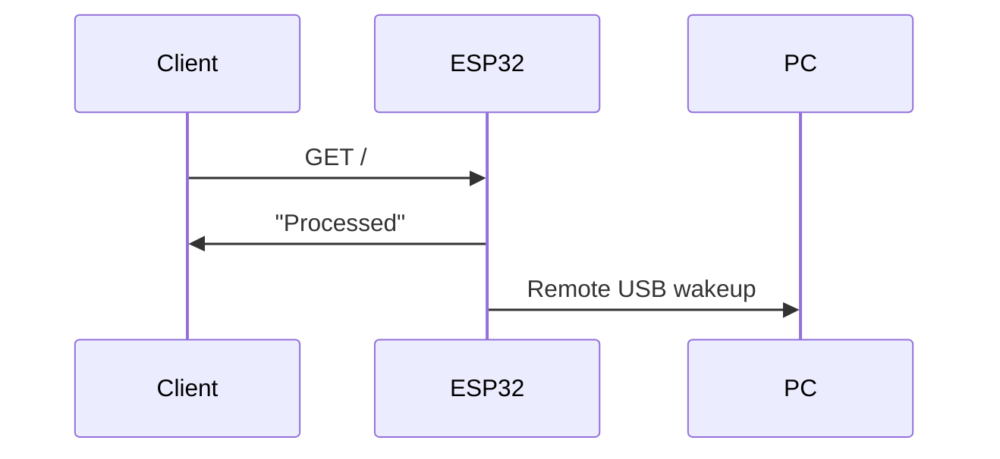

### About
This is a simple project to wakeup PC by using remote USB wakeup designed for ESP32 with WiFi module. The project was build around [ESP IDF](https://github.com/espressif/esp-idf). It works by starting HTTP server and listening for incoming requests. When a request to the specific URI has been made ESP32 will send remote USB wakeup command to a host to wake it up from suspension/hibernation.

The URI, Port of the HTTP server as well as SSID, Passphrase of a WiFi AP could be configured through `idf.py menuconfig` or directly through `sdkconfig`.

### Build
The build process with `idf.py` is pretty straightforward:
1. Set the target with `idf.py set-target <TARGET>`
2. Configure SSID and Passphrase and optionally URI and Port which are `/` and `80` respectively by default: `idf.py menuconfig`
3. Build: `idf.py build`
4. Upload to ESP32: `idf.py flash`
